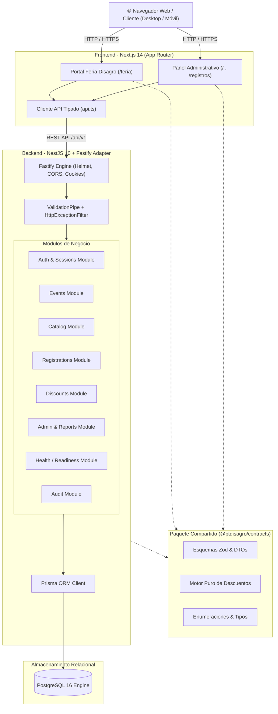
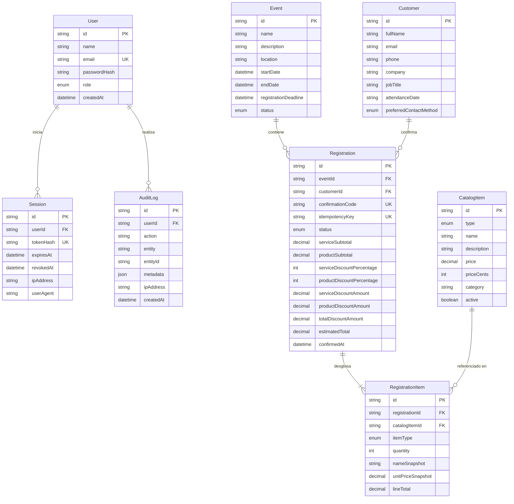
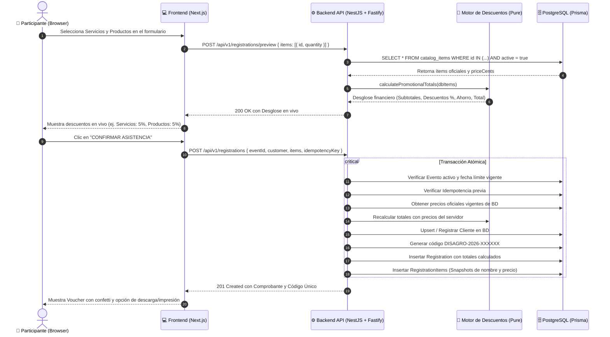

# Arquitectura del Sistema - Plataforma de Promociones Disagro 2026

## 1. Visión General de la Arquitectura

La plataforma está diseñada como un **Monorepo modular** utilizando **pnpm workspaces**, separando claramente las responsabilidades del equipo de Frontend y del equipo de Backend, vinculados por una capa común de contratos tipados (`@ptdisagro/contracts`).

---

## 2. Diagrama Entidad-Relación (Base de Datos)

---

## 3. Secuencia de Confirmación y Prevención de Manipulación

El siguiente diagrama ilustra el flujo de cálculo seguro sin confiar en los precios enviados por el navegador:

---

## 4. Estándares de Seguridad Aplicados

1. **Helmet**: Protección activa de headers HTTP (`X-Content-Type-Options`, `X-Frame-Options`, `Strict-Transport-Security`).
2. **CORS Dinámico**: Restricción de orígenes cruzados con soporte de credenciales seguras.
3. **Cookies HttpOnly**: La sesión administrativa `disagro_session` no puede ser leída ni manipulada mediante scripts de JavaScript en el cliente, mitigando ataques XSS.
4. **Hashes Criptográficos**: Los tokens de sesión se almacenan hasheados con SHA-256 en la base de datos; las contraseñas se almacenan procesadas con `bcrypt` (10 rounds).
5. **Idempotencia Transaccional**: Si una conexión de red inestable provoca el reenvío de una petición idéntica, el servidor detecta la clave de idempotencia y devuelve la confirmación ya existente sin duplicar reservas ni clientes.
6. **Manejo Centralizado de Excepciones**: Respuestas JSON uniformes (`statusCode`, `code`, `message`, `errors`, `requestId`) sin filtrar stack traces ni credenciales internas.
